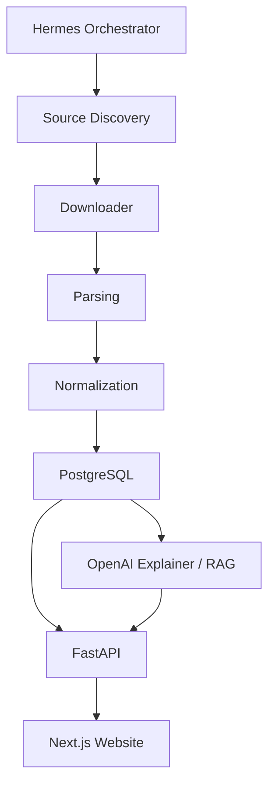

# Où va l'argent ? — Cahier des charges MVP

> **MVP** — Site interactif pour explorer le budget de l'État français, avec données officielles traçables, visualisation, recherche et explications IA.

## 1. Objectif

Créer un site permettant à n'importe quel citoyen de visualiser et d'explorer le budget de l'État français.

**Objectifs produit**

- Comprendre rapidement où va l'argent.
- Explorer les dépenses par niveau hiérarchique.
- Rechercher une dépense.
- Voir les évolutions d'une année à l'autre.
- Obtenir une explication en langage naturel basée sur les documents officiels.

**Principes**

- Traçable et sourcé.
- Reproductible.
- Mis à jour automatiquement.
- **Le LLM ne produit jamais les chiffres.**
- **PostgreSQL constitue la source de vérité.**
- Aucun montant n'est publié sans provenance officielle vérifiable.

## 2. Périmètre du MVP

### Inclus

Budget général de l'État :

```text
Mission
  └─ Programme
       └─ Action
```

Années initiales : **2025 et 2026**.

Fonctionnalités :

- Treemap interactive avec drill-down.
- Recherche.
- Pages dédiées pour chaque nœud budgétaire.
- Historique 2025/2026.
- Explication IA.
- Sources officielles accessibles depuis chaque donnée.

### Hors MVP

- Sécurité sociale.
- Collectivités territoriales.
- Simulateur budgétaire.
- Députés.
- Fiscalité détaillée.
- Contrats et marchés publics.
- Subventions par bénéficiaire.

## 3. Stack technique

| Couche | Technologie |
| --- | --- |
| Frontend | Next.js 15, TypeScript, Tailwind, D3.js, Zustand, TanStack Query |
| Backend | FastAPI, Python 3.13, Pydantic |
| Base de données | PostgreSQL 17 + pgvector |
| ETL / analyse | Python, Polars, DuckDB |
| Agents | Hermes |
| LLM | OpenAI |
| Frontend hosting | Vercel |
| Backend hosting | Railway |
| Database hosting | Supabase |

## 4. Architecture



Priorité d'ingestion : **API/CSV > XLSX > HTML > PDF**.

## 5. Modèle de données

### BudgetNode

```sql
CREATE TABLE budget_nodes (
    id UUID PRIMARY KEY,
    year INTEGER NOT NULL,
    parent_id UUID,
    node_type TEXT NOT NULL,
    name TEXT NOT NULL,
    code TEXT,
    amount_cp NUMERIC,
    amount_ae NUMERIC,
    description TEXT,
    ministry TEXT,
    mission TEXT,
    program TEXT,
    source_id UUID,
    created_at TIMESTAMP,
    updated_at TIMESTAMP
);
```

### Sources

```sql
CREATE TABLE sources (
    id UUID PRIMARY KEY,
    title TEXT,
    source_url TEXT,
    publication_date DATE,
    source_type TEXT,
    local_file TEXT
);
```

### Explanations

```sql
CREATE TABLE explanations (
    id UUID PRIMARY KEY,
    node_id UUID,
    model TEXT,
    summary TEXT,
    detailed TEXT,
    created_at TIMESTAMP
);
```

À prévoir également : contraintes de clés étrangères, index sur `year`, `parent_id`, `node_type`, `code`, recherche full-text et mécanisme de version/provenance.

## 6. API

### Arbre budgétaire

```http
GET /api/tree?year=2026
```

Réponse :

```json
{
  "id": "...",
  "name": "Budget général",
  "amount": 851000000000,
  "children": []
}
```

### Recherche

```http
GET /api/search?q=enseignement
```

### Détail d'un nœud

```http
GET /api/node/{id}
```

La réponse contient au minimum : identité, AE/CP, parent/enfants, historique, description, explication et sources.

## 7. Interface

### Homepage

- Titre : **Où va l'argent ?**
- Sélecteur d'année.
- Barre de recherche.
- Treemap principale.
- Indication claire du périmètre : « Budget général de l'État ».
- Montant total et définitions AE/CP accessibles.

### Page d'un nœud

Exemple : `/2026/mission/defense`

Afficher :

- Nom et code.
- Montant.
- Part du parent.
- Variation par rapport à 2025.
- Historique.
- Treemap des enfants.
- Explication IA.
- Sources.
- Breadcrumb Mission → Programme → Action.

## 8. Recherche

Recherche hybride :

```text
Query utilisateur
      ↓
PostgreSQL Full Text + embeddings
      ↓
BudgetNodes pertinents
      ↓
Résultats + éventuelle explication IA
```

Exemples : défense, armée, enseignants, justice, santé.

Le moteur doit distinguer un résultat exact d'une reconstruction sémantique.

## 9. Treemap

Chaque rectangle affiche :

- Nom.
- Montant.
- Pourcentage du parent.

Interaction :

- Clic = zoom vers le niveau inférieur.
- Breadcrumb pour remonter.
- Tooltip avec AE, CP, évolution et source.
- URL mise à jour pour permettre le partage direct.

Les variations doivent être présentées de façon descriptive et cohérente ; éviter qu'un code couleur implique à lui seul qu'une hausse est « bonne » ou une baisse « mauvaise ».

## 10. LLM / RAG

Le LLM reçoit uniquement les données structurées et passages de sources récupérés pour le nœud concerné.

Entrée type :

```json
{
  "name": "...",
  "description": "...",
  "historical_values": [],
  "source_text": []
}
```

Sortie structurée :

```json
{
  "summary": "...",
  "what_it_funds": "...",
  "main_changes": "...",
  "limitations": "..."
}
```

Règles :

- Ne jamais inventer un montant.
- Ne jamais remplacer la valeur PostgreSQL par une valeur générée.
- Citer les passages utilisés.
- Dire explicitement quand les documents ne permettent pas d'expliquer une variation.
- Séparer faits, explications documentées et éventuelles reconstructions.

## 11. Sources et pipeline

Sources prioritaires :

- [budget.gouv.fr](https://www.budget.gouv.fr/)
- [data.gouv.fr](https://www.data.gouv.fr/)
- PLF et documents associés
- PAP
- RAP
- Lois de finances rectificatives

Le pipeline doit conserver :

- URL originale.
- Date de récupération.
- Type de document.
- Année budgétaire.
- Hash du fichier.
- Version.
- Page/section ou cellule source lorsque possible.

## 12. Agents Hermes

### Budget Orchestrator

Coordonne les agents, les dépendances, les retries et les validations. Il ne publie rien tant que les contrôles nécessaires ne sont pas passés.

### Source Scout

Détecte les nouveaux documents et changements de sources officielles.

Sortie type :

```json
{
  "new_document": true,
  "url": "...",
  "type": "PAP"
}
```

### Downloader

Télécharge les fichiers dans `/storage/raw` et conserve leurs métadonnées/hash.

### Parser

Transforme CSV, XLSX, HTML et PDF en objets structurés Mission / Programme / Action / AE / CP.

### Classification / Normalization

Rattache les lignes aux bons nœuds et normalise codes, noms, années et unités.

### Validator

Vérifie qu'un montant publié peut être retrouvé dans la source. En cas de doute :

```text
FLAG_REVIEW
```

### Explanation Generator

Produit résumé, rôle de la dépense et explication documentée des principales variations.

### Update Monitor

Surveille les nouvelles publications et déclenche une nouvelle ingestion sans écraser silencieusement l'historique.

## 13. Admin

Dashboard interne avec :

- Sources découvertes.
- État des téléchargements.
- Documents parsés.
- Nombre de BudgetNodes.
- Pourcentage avec source valide.
- Anomalies.
- Montants incohérents.
- Sources manquantes.
- Éléments `FLAG_REVIEW`.
- Historique des runs Hermes.

Aucune anomalie critique ne doit être publiée automatiquement.

## 14. SEO et URLs

URLs lisibles :

```text
/2026
/2026/mission/defense
/2026/mission/defense/programme-146
/2026/mission/defense/programme-146/action-xx
```

Chaque page génère titre, description et données structurées adaptées.

Exemple :

```html
<title>Mission Défense 2026 - Où va l'argent ?</title>
```

## 15. Structure du repository

```text
budget-france/
├── apps/
│   ├── web/
│   └── admin/
├── api/
├── agents/
│   ├── orchestrator/
│   ├── source-scout/
│   ├── downloader/
│   ├── parser/
│   ├── classifier/
│   ├── validator/
│   └── monitor/
├── pipelines/
│   ├── budget-gouv/
│   ├── data-gouv/
│   └── other/
├── database/
│   ├── schema/
│   └── migrations/
├── prompts/
├── storage/
├── tests/
└── docs/
```

## 16. Déploiement

- Next.js → Vercel.
- FastAPI → Railway.
- PostgreSQL / pgvector → Supabase.
- Variables secrètes uniquement via l'environnement.
- Environnements séparés dev / staging / production.
- Docker Compose pour développement local.

## 17. Ordre d'implémentation

- [ ] Créer le repository et les conventions Git.
- [ ] Identifier les sources structurées 2025/2026.
- [ ] Concevoir le schéma PostgreSQL et les migrations.
- [ ] Construire l'ingestion d'une mission pilote.
- [ ] Ajouter validation et provenance.
- [ ] Étendre l'ingestion à 100 % du budget général ciblé.
- [ ] Construire FastAPI.
- [ ] Construire recherche.
- [ ] Construire Next.js et la treemap.
- [ ] Ajouter pages détaillées et historique.
- [ ] Ajouter RAG / explications OpenAI.
- [ ] Construire l'admin.
- [ ] Ajouter tests d'intégrité et tests end-to-end.
- [ ] Déployer staging.
- [ ] Auditer les données avant production.

> 🎯 **Critère de sortie du socle data :** 100 % des nœuds publiés du budget général 2026 doivent avoir une provenance exploitable et les totaux parent/enfants doivent être contrôlés avant de considérer l'interface comme fiable.

## 18. Critères d'acceptation du MVP

Le MVP est considéré fonctionnel lorsque :

- Un utilisateur peut partir du budget général et descendre Mission → Programme → Action.
- Chaque montant affiché renvoie vers sa provenance.
- 2025 et 2026 sont comparables à nomenclature compatible ou avec rupture explicitement signalée.
- La recherche retrouve les nœuds par nom, code et termes proches.
- Les explications IA sont fondées sur les sources récupérées.
- Une hallucination du LLM ne peut pas modifier les montants affichés.
- Les anomalies détectées sont bloquées ou signalées avant publication.
- Les pages sont partageables via URL.

## 19. Prompt maître pour Hermes

```text
Tu es l'architecte principal du projet "Où va l'argent ?".

Objectif :
Construire un site permettant d'explorer le budget de l'État français.

Contraintes :
- Les chiffres ne doivent jamais être inventés.
- Toute donnée doit posséder une source officielle.
- Les sources structurées sont prioritaires sur les PDF.
- Les montants doivent être vérifiables.
- Le LLM est utilisé pour extraction complexe, classification, recherche sémantique et explication, mais jamais comme source de vérité numérique.
- PostgreSQL constitue la source de vérité.
- Toute transformation de données doit être traçable.
- Les anomalies doivent être FLAG_REVIEW et ne pas être publiées silencieusement.
- Utiliser Git proprement : commits atomiques, branches de travail, tests avant merge et aucune modification destructive non justifiée.

Mission :
1. Créer l'architecture du projet.
2. Identifier les sources officielles 2025 et 2026.
3. Générer le schéma SQL et les migrations.
4. Construire le pipeline d'ingestion et de validation.
5. Construire l'API FastAPI.
6. Construire le frontend Next.js.
7. Construire les agents Hermes spécialisés.
8. Ajouter les tests.
9. Générer la documentation.
10. Générer Docker Compose.
11. Préparer le déploiement Vercel + Railway + Supabase.

Ordre impératif :
Commencer par les sources et le modèle de données. Construire ensuite l'ingestion et les validations. Ne commencer l'UI qu'une fois une mission pilote ingérée correctement et testée.

Avant chaque grande phase :
- analyser l'état du repository ;
- créer un plan ;
- définir les tests d'acceptation ;
- travailler sur une branche adaptée ;
- exécuter les tests ;
- documenter les décisions importantes.

Ne jamais sacrifier la traçabilité des données pour accélérer l'interface.
```

## 20. Évolutions après MVP

**V2** — Historique long (par exemple 2017–2026), meilleur moteur de comparaison et niveau « dispositif/mesure » lorsque les sources le permettent.

**V3** — Sécurité sociale et collectivités, avec périmètres clairement séparés afin d'éviter les doubles comptes.

**V4** — Graphe des bénéficiaires lorsque les données publiques permettent le rattachement, chatbot budgétaire avancé et simulateur permettant de modifier des hypothèses sans recommander de choix politique.

---

_Source : page Notion « Où va l'argent ? — Cahier des charges MVP », consultée le 18 septembre 2026._
